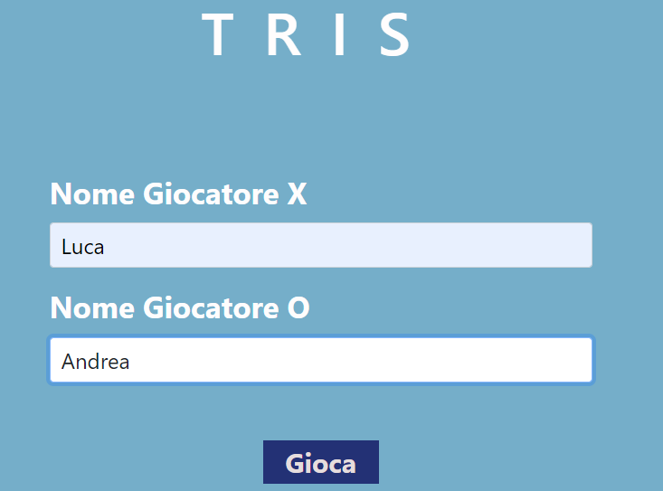
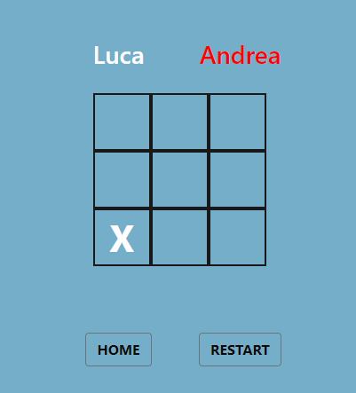
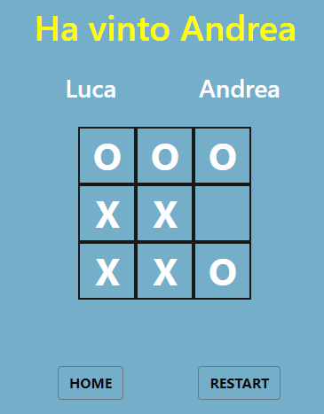
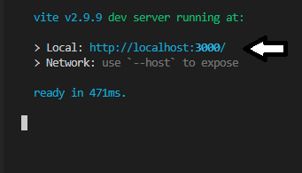

<h1 algin="center">Mini-sito del famoso gioco Tic Tac Toe (Tris)</h1>

  
Sommario

  <ol>
    <li>
      <a href="#informazioni-sul-progetto">Informazioni sul progetto</a>
      <ul>
        <li><a href="#costruito-con">Costruito con</a></li>
      </ul>
    </li>
   <li><a href="#descrizione">Descrizione</a>
     <ul>
        <li><a href="#Download-e-testare-app-in-locale">Download e testare app in locale</a></li>
      </ul>
    </li>
   <li><a href="#licenza">Licenza</a></li>
  <ol>

<!-- Informazioni sul progetto-->

## Informazioni sul progetto

La finalità di questo progetto è quella di sviluppare  un mini-sito del famoso gioco Tic Tac Toe (Tris) usando il framework Vue.js.

L'applicazione è stata deployata su Netlify :
- [Link Netlify] (https://incomparable-syrniki-79e8ad.netlify.app)</h4>

#### <h3>Costruito con:</h3>

<b>Framework</b>:

- [Vue.js] (https://vuejs.org/)
- [Bootstrap] (https://getbootstrap.com/)

<!--Descrizione-->

## Descrizione

### Descrizione Funzionamento
- Il gioco è stato svilupatto per giocare in due.
Nella schermata iniziale del gioco si inseriscono i nomi dei due giocatori.
 
- Al primo giocatore gli viene assegnato il simbolo "X", invece al secondo giocatore viene assegnato il simbolo "O". 

- Per ripulire il tavolo di gioco premere "RESTART".

### Download e testare app in locale

- Sul proprio dispositivo è necessario installare: 
   - Nodo.js
   - gestore di pachetti npm. 

L'app può essere testata in locale eseguendo i seguenti passaggi:

- Clonare il repository del progetto in locale 

- Aprire la folder del progetto con un terminale, ed eseguire il comando "npm install".

- Testare l'app in locale tramite il comando "npm run dev".

## Licenza

    Distribuito con licenza MIT. Vedere "LICENSE" per ulteriori informazioni.
